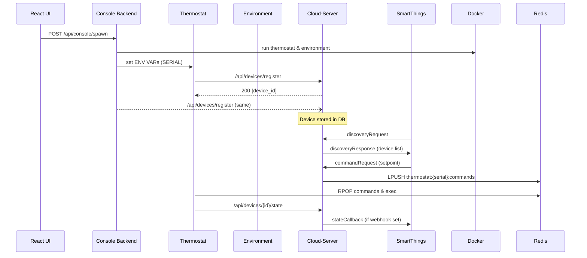

# Virtual Thermostat Testbed – Architecture & API Reference  
*(Generated 2025-06-12)*  

---

## Table of Contents
1. Project Overview  
2. Container Topology (Docker Compose)  
3. Data-flow & Inter-service Sequence  
4. Service Reference  
   1. Cloud-Server (FastAPI, port 8081)  
   2. Backend Console – Backend (FastAPI, port 8088)  
   3. Backend Console – Frontend (React, port 3000)  
   4. Thermostat Device (FastAPI, port 8000 per-device)  
   5. Environment Simulator (FastAPI, port 8001 per-device)  
   6. Infrastructure Images (Redis, Postgres, Ngrok)  
5. Redis Key-space Convention  
6. Database Schema (SQLAlchemy Models)  
7. Environment Variables  
8. Build / Run / Deploy  
9. Appendix A – SmartThings Schema Payloads  
10. Appendix B – Mermaid Sequence Diagrams  

---

## 1. Project Overview
The **Virtual Thermostat Testbed** emulates fleets of HVAC thermostats and their home environments, exposes a management console, and integrates with **SmartThings** via a Cloud Connector.

* **Fleet simulation** — each virtual home is a *pair* of containers:  
  • `thermostat-${serial}` = device brain  
  • `environment-${serial}` = physics & energy model  
* **Console UI & API** — spawn devices, observe telemetry, export data, issue commands.  
* **Cloud Connector** — translates device data/state into SmartThings Schema interactions.  
* **HELICs export** — real-time energy feed for co-simulation.

The system is fully containerised, orchestrated by **docker-compose**.

---

## 2. Container Topology

```mermaid
flowchart LR
  subgraph Core Infrastructure
    redis[Redis 7] <--6379--> redisClients
    postgres[(Postgres 15)] 
    cloud[Cloud-Server<br/>FastAPI 8080] 
    redis -.-> cloud
    postgres -.-> cloud
    ngrok[Ngrok tunnel]
    ngrok -.-> cloud
  end

  subgraph Console Stack
    consoleBE[Backend Console<br/>FastAPI 8088]
    consoleFE[React App 3000]
    redis -.-> consoleBE
    postgres -.-> consoleBE
    cloud -. "HTTP" .-> consoleBE
    consoleFE -.Fetch-> consoleBE
  end

  subgraph Dynamic Device Pair
    thermostat[Thermostat<br/>FastAPI 8000] 
    envSim[Environment Simulator<br/>FastAPI 8001]
    thermostat <--Redis--> redis
    envSim <--Redis--> redis
    thermostat <--HTTP--> cloud
    thermostat <--HTTP--> envSim
  end
```

*Subnet* `172.22.0.0/16` (`testbed-network`) shares DNS for container name resolution (`thermostat-<serial>` etc.).

---

## 3. Data-flow & Sequence

1. **Spawn** (console):  
   `POST /api/console/spawn` →  
   ‑ CLI `docker run` device pair →  
   ‑ Console registers device with Cloud-Server (`/api/devices/register`).  

2. **Discovery** (SmartThings):  
   SmartThings sends `discoveryRequest` → Cloud returns device list.  
   If callback tokens are missing Cloud includes `"requestGrantCallbackAccess": true`.

3. **State Loop**:  
   a. Environment pushes `temperature` to Thermostat every ~10 sec.  
   b. Thermostat evaluates control loop (5 sec) and writes `thermostat:<serial>:state` in Redis & `/api/devices/{device_id}/state` to Cloud.  
   c. Cloud may push `stateCallback` to SmartThings if webhook tokens are active.

4. **Commands**:  
   SmartThings → Cloud `commandRequest` → Cloud writes `thermostat:<serial>:commands` list in Redis → Thermostat pops and executes.

Detailed diagrams in **Appendix B**.

---

## 4. Service Reference

### 4.1 Cloud-Server (`cloud-server/main.py`)

| Method | Path | Body / Params | Description |
| ------ | ---- | ------------- | ----------- |
| GET | `/health` | – | Liveness & ngrok URL. |
| **Device Mgmt** ||||
| POST | `/api/devices/register` | `DeviceRegistration` JSON | Register serial, returns `{device_id, username}`. |
| GET | `/api/devices` | – | List DB devices. |
| POST | `/api/devices/{device_id}/state` | `DeviceState` | Persist state (called by thermostat). |
| POST | `/api/devices/{serial}/state-changed` | – | Trigger SmartThings `stateCallback`. |
| POST | `/api/devices/discovery-changed` | `{"user_id":?}` | Trigger SmartThings `discoveryCallback`. |
| **OAuth (for SmartThings account-link)** ||||
| GET | `/oauth/authorize` → HTML | – | Login page / consent. |
| POST | `/oauth/login` | form | Session login. |
| GET/POST | `/oauth/consent`, `/oauth/authorize/consent` | – | Consent screen. |
| POST | `/oauth/token` | form (`authorization_code` or `refresh_token`) | Issue bearer tokens for SmartThings. |
| **Schema Connector** ||||
| POST | `/schema` | SmartThings payload | Handles *discovery*, *stateRefresh*, *command*, *grantCallbackAccess*, etc. |
| POST | `/` | Alias to `/schema` | |
| **Callback Reciprocal Token** ||||
| POST | `/oauth/callback/token` | form (`client_credentials` or `refresh_token`) | Issue *callback* tokens for SmartThings → Cloud. |

#### Database Models
`User`, `Device`, `OAuthToken` (see §6).

#### Env-vars
```
DATABASE_URL, REDIS_URL, NGROK_*,
JWT_SECRET, SMARTTHINGS_CLIENT_ID/SECRET,
SMARTTHINGS_CALLBACK_CLIENT_ID/SECRET
```

---

### 4.2 Backend Console – Backend (`backend-console/backend/main.py`)

| Method | Path | Description |
| ------ | ---- | ----------- |
| GET | `/health` | Service health. |
| POST | `/api/console/spawn` | Spawn device pair; registers with Cloud; returns serial & container IDs. |
| POST | `/api/console/weather-override` | Override outdoor temp for **all** envs. |
| GET | `/api/console/export/{username}` | Export device + history JSON. |
| GET | `/api/console/dashboard` | Aggregate KPIs (active devices, power, avg temp). |
| GET | `/api/console/devices` | Rich list inc. legacy detection. |
| DELETE | `/api/console/device/{serial}` | Stop & remove containers; purge Redis. |
| POST | `/api/console/device/{serial}/weather-override` | Override outdoor temp one device. |
| POST | `/api/console/device/{serial}/setpoint` | Queue set_temperature cmd. |
| POST | `/api/console/device/{serial}/mode` | Queue set_mode cmd. |
| POST | `/api/console/device/{serial}/current-temp` | Inject indoor temp override. |
| **HELICs** ||
| GET | `/api/helics/power-consumption` | All homes snapshot. |
| GET | `/api/helics/power-consumption/{serial}` | One home. |
| WS | `/api/helics/stream` | Live power updates (JSON). |
| **Static / React** ||
| GET | `/` , `/{path}` | Serves React build (SPA). |

Uses **Docker CLI** (not python-docker) and Redis.

---

#### 4.2.1 REST API Details (Backend Console – Backend)

The following tables document **all** available endpoints, request bodies, query parameters, and example responses for the FastAPI service listening on **port 8088**.

| Category | Method & Path | Auth | Request Body / Params | Success `200` Response (shape) | Notes |
|----------|---------------|------|-----------------------|--------------------------------|-------|
| **Health** | `GET /health` | – | – | `{ "status": "healthy" }` | Liveness probe |
| **Device Lifecycle** | `POST /api/console/spawn` | – | `{"username":"<str>","environment_config":"random"|"<yaml-file>"}` | `{serial_number, config_file, thermostat_container_id, environment_container_id}` | Spawns a thermostat/environment pair and registers with Cloud; returns Docker IDs |
| ▲  | `DELETE /api/console/device/{serial}` | – | – | `{status:"success",serial}` | Stops & removes both containers and purges Redis keys |
| **Weather Overrides** | `POST /api/console/weather-override` | – | `{"temperature":<float>,"duration_hours":<int>}` | `{status, devices_updated, temperature, duration_hours}` | Broadcast override across **all** env containers |
| ▲ (per-device) | `POST /api/console/device/{serial}/weather-override` | – | `{"temperature":<float>}` | `{status, serial, temperature}` | One device override, persists 1 h |
| **Per-Device Manipulation** | `POST /api/console/device/{serial}/setpoint` | – | `{"target_temp":<float>}` | `{status, serial, target_temp}` | Pushes *set_temperature* command into Redis queue |
| ▲ | `POST /api/console/device/{serial}/mode` | – | `{"mode":"off"|"heat"|"cool"|"auto"}` | `{status, serial, mode}` | Pushes *set_mode* command |
| ▲ | `POST /api/console/device/{serial}/current-temp` | – | `{"temperature":<float>}` | `{status, serial, current_temp}` | Instantaneously overrides indoor temp via Redis for env-sim |
| **Fleet Query** | `GET /api/console/devices` | – | – | `[ { serial_number, username, config_file, ... } ]` | Combines metadata + live state/power; legacy support |
| ▲ | `GET /api/console/dashboard` | – | – | `{active_devices, total_energy_consumption, average_temperature, timestamp}` | Aggregated KPIs |
| **Data Export** | `GET /api/console/export/{username}` | – | – | `{export_timestamp, user, devices:[ ... ]}` | Full JSON dump: history + power |
| **HELICs Power** | `GET /api/helics/power-consumption` | – | – | `{timestamp, total_homes, total_power_kw, homes:[ ... ]}` | Snapshot |
| ▲ | `GET /api/helics/power-consumption/{serial}` | – | – | `{home_id, power_kw, hvac_state, ...}` | Single home |
| ▲ (stream) | `WS /api/helics/stream` | – | – | JSON push every ≈1 s: `{type:"power_update", timestamp, updates:[ ... ]}` | Server–sent websocket |
| **Static Assets** | `GET /` | – | – | React index.html | Root SPA launch |
| ▲ | `GET /{any_non_api_path}` | – | – | React index.html | SPA fallback routes |

##### Data Models

```jsonc
// SpawnDeviceRequest
{
  "username": "admin",
  "environment_config": "small_apartment_efficient.yaml" // or "random"
}

// WeatherOverrideRequest
{
  "temperature": 95.0,
  "duration_hours": 6
}

// DeviceWeatherOverrideRequest
{ "temperature": 30.0 }

// DeviceSetpointRequest
{ "target_temp": 68.0 }

// DeviceModeRequest
{ "mode": "heat" }

// PowerConsumptionData (WS update element)
{
  "home_id": "VST-1A2B-3C4D-5E6F",
  "power_kw": 3.2,
  "hvac_state": "cool",
  "indoor_temp": 74.1,
  "outdoor_temp": 92.8,
  "setpoint": 72,
  "efficiency_rating": 13.0,
  "home_size_sqft": 750
}
```

### 4.3 Backend Console – Frontend (React)

* Location: `backend-console/frontend/`  
* Built assets served under `/static` by backend.  
* Env: `REACT_APP_API_URL` (defaults `http://localhost:8088`).  

---

### 4.4 Thermostat Device (`thermostat/main.py`)

| Path | Method | Purpose |
| ---- | ------ | ------- |
| `/health` | GET | Liveness + serial. |
| `/api/v1/device/status` | GET | Current full state. |
| `/api/v1/device/setpoint` | POST JSON `{target_temp}` | Change setpoint. |
| `/api/v1/device/mode` | POST `{mode}` | Change HVAC mode. |
| `/api/v1/device/fan` | POST `{fan_mode}` | Fan on/auto. |
| `/api/v1/cloud/command` | POST `CloudCommand` | Internal path used by Cloud for direct push (fallback). |
| `/api/v1/environment/temperature` | POST `{temperature,humidity?}` | Called by env-sim. |

Runs a **5 s control loop** writing state to Redis and notifying Cloud.

---

### 4.5 Environment Simulator (`environment-simulator/main.py`)

| Path | Method | Description |
| ---- | ------ | ----------- |
| `/health` | GET | Liveness, config name. |
| `/api/v1/status` | GET | Current environmental metrics. |
| `/api/v1/override/temperature` | POST number | Force outside temp. |
| `/api/v1/power` | GET | Instantaneous & cumulative energy. |

Runs a **10 s simulation loop** (1 minute simulation time), exchanges HVAC state via Redis, computes physics based on YAML config under `config/environments/`.

---

### 4.6 Infrastructure Images
* **redis** – key-value & pub/sub (persistent volume `redis-data`).  
* **postgres** – relational DB for users/devices/tokens (volume `postgres-data`).  
* **ngrok** – exposes Cloud-Server externally (`vt-testbed-2025.ngrok.app`).

---

## 5. Redis Key-space

| Pattern | Contents |
| ------- | -------- |
| `thermostat:{serial}:state` | Current `ThermostatState` JSON. |
| `thermostat:{serial}:history` | List of past state entries. |
| `thermostat:{serial}:commands` | Redis list of pending commands. |
| `thermostat:{serial}:hvac_state` | HVAC running flag for env-sim. |
| `environment:{serial}:state` | Env parameters + energy. |
| `environment:{serial}:power` | Instant power snapshot. |
| `device:{serial}:metadata` | Spawn metadata (`username`, `config_file`, containers…). |
| `smartthings_callback:{user_id|global}` | OAuth callback tokens. |
| `auth_code:*`, `oauth_session:*` | Temporary OAuth data. |

---

## 6. Database Schema (Cloud-Server)

```text
users
 ├─ id              INTEGER PK
 ├─ username        TEXT UNIQUE
 ├─ password_hash   TEXT
 └─ created_at      TIMESTAMP

devices
 ├─ id              INTEGER PK
 ├─ serial_number   TEXT UNIQUE
 ├─ device_id       TEXT UNIQUE (dxxxxxxx)
 ├─ user_id         FK → users.id
 ├─ smartthings_device_id TEXT NULL
 ├─ created_at      TIMESTAMP
 └─ config_file     TEXT

oauth_tokens
 ├─ id              INTEGER PK
 ├─ user_id         FK → users.id
 ├─ access_token    TEXT UNIQUE
 ├─ refresh_token   TEXT UNIQUE
 ├─ expires_at      TIMESTAMP
 └─ created_at      TIMESTAMP
```

---

## 7. Environment Variables

| Variable | Default | Used by |
| -------- | ------- | ------- |
| `DATABASE_URL` | postgresql… | cloud-server, console-backend |
| `REDIS_URL` | redis://redis:6379 | cloud-server, console-backend |
| `CLOUD_SERVER_URL` | http://cloud-server:8080 | console-backend, thermostat |
| `NGROK_AUTH_TOKEN` / `NGROK_DOMAIN` | – | cloud-server, ngrok |
| `JWT_SECRET` | your-jwt-secret | cloud-server |
| `SMARTTHINGS_CLIENT_ID/SECRET` | – | cloud-server OAuth |
| `SMARTTHINGS_CALLBACK_CLIENT_ID/SECRET` | – | cloud-server callback |
| `REACT_APP_API_URL` | http://localhost:8088 | console-frontend |
| `SERIAL_NUMBER`, `THERMOSTAT_SERIAL`, `CONFIG_FILE` | autogenerated | device pair |

---

## 8. Build / Run / Deploy

```bash
# one-liner to start everything
docker compose up -d --build

# spawn 5 sample devices
curl -X POST localhost:8088/api/console/spawn -H 'Content-Type: application/json' \
     -d '{"username":"admin","environment_config":"random"}'

# open console UI
open http://localhost:3000
```

Stop & clean:

```bash
docker compose down
./scripts/cleanup.sh           # removes dynamic containers & Redis keys
```

---

## 9. Appendix A – SmartThings Schema Payload Snippets

<details>
<summary>discoveryRequest → discoveryResponse</summary>

```jsonc
{
  "headers": { "interactionType": "discoveryRequest", ... }
}
=== response ===
{
  "headers": { "interactionType": "discoveryResponse", ... },
  "devices": [
    {
      "externalDeviceId": "VST-1A2B-3C4D-5E6F",
      "deviceHandlerType": "c2c-thermostat-battery",
      "friendlyName": "Virtual Thermostat 3C4D",
      "deviceCookie": { "userId": 1 }
    }
  ]
}
```
</details>

Further examples: *stateRefreshRequest*, *commandRequest*, *stateCallback* are in `cloud-server/main.py` logs.

---

## 10. Appendix B – Mermaid Sequence (Spawn-to-SmartThings)



---

*End of documentation.*
